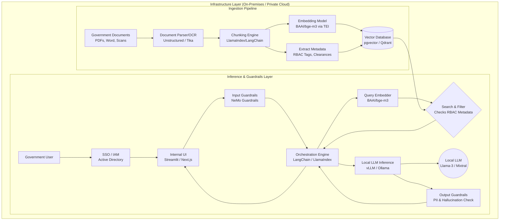

# Government/Air-gapped RAG System Architecture

Designing a Retrieval-Augmented Generation (RAG) system for a government entity requires a strict **"self-hosted, local-only"** approach to ensure data sovereignty, privacy, and compliance. This means no data can be sent to public APIs like OpenAI, Anthropic, or proprietary cloud embedding services.

Here is a comprehensive architecture for a highly secure, private RAG system.

## 1. High-Level Architecture Diagram

## 2. Core Technology Stack (100% Open Source / Self-Hostable)

### A. Large Language Models (LLMs)
Since you cannot use OpenAI, you must host open-weights models on local GPU infrastructure.
*   **Inference Engine:** **vLLM** (highly optimized for parallel requests) or **Ollama** (easier for single-node setups). Both provide drop-in replacement APIs for OpenAI's standard, meaning standard code libraries still work.
*   **Heavy Reasoning Model:** `Meta-Llama-3-70B-Instruct` or `Mixtral-8x22B`. Recommended for the final synthesis and complex reasoning.
*   **Fast/Routing Model:** `Meta-Llama-3-8B-Instruct`. Recommended for internal orchestration tasks like query rewriting or guardrails.

### B. Embedding Models
These convert your documents and queries into vectors.
*   **Model:** `BAAI/bge-m3` (strong multilingual support and highly rated) or `nomic-embed-text`.
*   **Serving:** Hugging Face **Text Embeddings Inference (TEI)** for high-throughput GPU-accelerated serving.

### C. Vector Database
*   **Recommendation:** **PostgreSQL with `pgvector`**. 
    *   *Why for Government:* Government IT heavily trusts PostgreSQL. It integrates easily with existing backup, high-availability, and auditing infrastructure.
*   **Alternative (Massive Scale):** **Qdrant** or **Milvus** (both open-source, rust/go-based, and highly scalable for billions of vectors).

### D. Document Ingestion
Government bodies have massive amounts of scanned PDFs and complex reports.
*   **Extractors:** **Unstructured.io** (can be hosted as a local docker container) handles complex PDFs and layout parsing. Apache Tika for standard docs.
*   **OCR:** Tesseract or locally hosted specialized vision models (like Qwen-VL) to extract text from images.

### E. Orchestration Framework
*   **LlamaIndex** or **LangChain** (Python-based). These will glue the local vector DB and local LLM together.

## 3. Security, Compliance & Guardrails (Critical for Gov)

A government RAG system has strict requirements beyond just running locally:

*   **Role-Based Access Control (RBAC) at the Vector Level:** 
    *   **The Problem:** An LLM might synthesize an answer using top-secret documents, exposing it to a low-clearance user.
    *   **The Solution:** When documents are chunked and inserted into the Vector DB, they must be tagged with strict `clearance_level` or `department_id` metadata. When a user queries the system, the Orchestrator must enforce a pre-filter on the vector query (e.g., `WHERE document.clearance <= user.clearance`).
*   **Data Guardrails:**
    *   Use **NVIDIA NeMo Guardrails** or **Llama Guard** locally to intercept prompts and LLM outputs.
    *   Check for attempts to jailbreak the model, prompt injections, or outputs that accidentally leak highly sensitive recognizable patterns (PII, SSNs).
*   **Full Audit Logging:** Every prompt, retrieved chunk array, generated response, and User ID must be securely logged for compliance reviews.

## 4. Hardware Requirements
Operating entirely without cloud APIs means requiring dedicated local hardware:
*   **Production Deployment:** A clustered Kubernetes environment with multiple **NVIDIA H100 or A100 (80GB)** GPUs for running 70B+ parameter models seamlessly with high simultaneous user concurrency.
*   **Development/Prototyping:** A workstation with 1-2 RTX 4090s or a Mac Studio with high memory (e.g., M2 Ultra with 128GB+ RAM) which can effectively run Ollama/MLX for Proof of Concepts.
